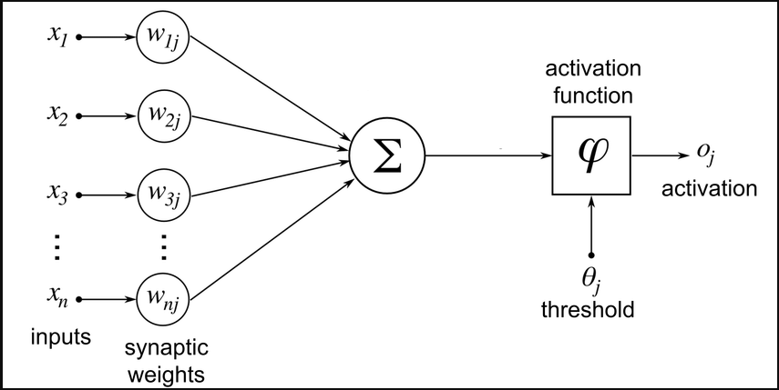
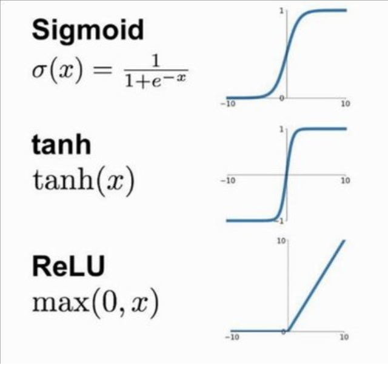
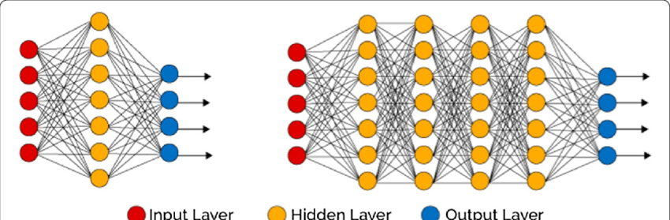

<h1>
  Intro to Neural Networks + Overview of AI Architectures 
  Introduction to Neural Networks
</h1>

**Learning objective:** By the end of this lesson, you'll be able to:

- **Understand** the structure and function of an artificial neuron.
- **Explain** the role of activation functions in introducing non-linearity.
- **Differentiate** between shallow and deep neural network architectures.
- **Engage** in a simple design activity applying these concepts.

## Understanding Artificial Neurons

- **What is an Artificial Neuron?**
  - **Analogy:** Think of it like a recipe. Ingredients (inputs) are measured (weighted), adjusted (bias), and then processed (activation function) to produce a dish (output).
- **Key Components:**
  - **Inputs:** The raw data or features.
  - **Weights:** Determine the importance of each input.
  - **Bias:** Adjusts the output threshold.
  - **Activation Function:** Decides if the neuron “fires.”

## Activation Functions

- **Why They Matter:**
  - Introduce non-linearity, allowing neural networks to model complex patterns.
- **Popular Activation Functions:**
  - **ReLU:** Outputs the input if positive; otherwise, zero. Ideal for hidden layers.
  - **Sigmoid:** Squashes values between 0 and 1, useful for probability outputs.

Imagine an activation function as a gate: it decides if the signal should pass through or not.

## Shallow vs. Deep Neural Networks

- **Shallow Networks:**
  - **Definition:** A network with just one hidden layer.
  - **Example Use-Cases:** Predicting house prices, simple binary classification (e.g., spam detection).
- **Deep Networks:**
  - **Definition:** Networks with multiple hidden layers.
  - **Advantages:** Capable of learning hierarchical features (e.g., edges to objects in images).
  - **Challenges:** Overfitting, computational cost, and training complexities.

## Forward Propagation and Backpropagation

### **Forward Propagation:**

- **Process:** Data flows from input through each layer to produce an output.

graph TD;
    A[Input] --> B[Hidden 1];
    B --> C[Hidden 2];
    C --> D[Output];

### **Backpropagation:**

- **Purpose:** Adjust weights and biases based on error feedback.
- **Simplification:** Compare it to adjusting a recipe based on taste tests.

graph TD;
    D[Output] --> C[Hidden 2];
    C --> B[Hidden 1];
    B --> A[Input];

### **Think about it 🤔**

- Why do you think backpropagation is essential for learning?

## **Activity**: Designing a Neural Network for Traffic Congestion Prediction

1. **Define the Task:**
   - **Inputs:** Vehicle counts, time of day, weather conditions.
   - **Output:** Traffic light durations (e.g., green, yellow, red).
2. **Design the Neuron:**
   - **Weights:** Determine which input (e.g., vehicle count) is most influential.
   - **Bias:** Adjust the threshold for the neuron’s activation.
   - **Activation Function:**
     - Consider using **ReLU** for handling traffic intensity.
     - Think about **Sigmoid** for binary decisions like congestion vs. no congestion.
3. **Select the Network Architecture:**
   - **Shallow Network:** Might suffice for simple traffic patterns.
   - **Deep Network:** Better for capturing complex relationships (e.g., interplay of weather and time).
4. **Discussion Points:**
   - Which activation function would work best for this scenario and why?"
   - How might noisy data or overfitting impact this design?

- **Activity Instructions:**
  - In pairs, quickly sketch a simple diagram of your neural network design.
  - Be prepared to talk through your design and proccess!

Click for Sample Diagram

flowchart TD
    subgraph Input Layer
      A1[Vehicle Count]
      A2[Time of Day]
      A3[Weather]
    end

    subgraph Hidden Layer
      B1[Neuron 1 ReLU]
      B2[Neuron 2 ReLU]
      B3[Neuron 3 ReLU]
      B4[Neuron 4 ReLU]
      B5[Neuron 5 ReLU]
    end

    subgraph Output Layer
      C1[Green Duration Linear]
      C2[Yellow Duration Linear]
      C3[Red Duration Linear]
    end

    A1 --> B1
    A1 --> B2
    A1 --> B3
    A1 --> B4
    A1 --> B5

    A2 --> B1
    A2 --> B2
    A2 --> B3
    A2 --> B4
    A2 --> B5

    A3 --> B1
    A3 --> B2
    A3 --> B3
    A3 --> B4
    A3 --> B5

    B1 --> C1
    B1 --> C2
    B1 --> C3

    B2 --> C1
    B2 --> C2
    B2 --> C3

    B3 --> C1
    B3 --> C2
    B3 --> C3

    B4 --> C1
    B4 --> C2
    B4 --> C3

    B5 --> C1
    B5 --> C2
    B5 --> C3

