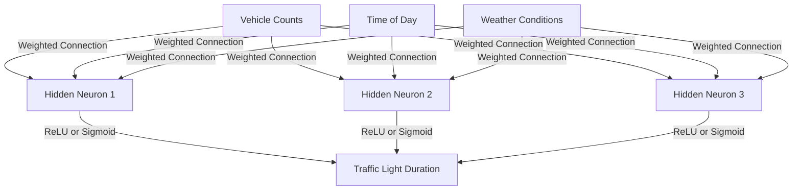

<h1>
  Intro to Neural Networks + Overview of AI Architectures 
  Introduction to Neural Networks
</h1>

## A. Basics of Neural Networks  

### 1. Understanding Artificial Neurons  
Artificial neurons, often referred to as perceptrons, form the fundamental units of neural networks. They are inspired by the functioning of biological neurons, which process information through electrical signals.  

Artificial neurons process information by taking inputs, assigning weights to these inputs (to represent their importance), summing them up, and passing the result through an activation function. This output is then sent to the next layer in the network.  

#### Key Features of Artificial Neurons:
- 📥 **Inputs**: Represent data or features from the problem domain, such as pixels in an image or words in a sentence.  
- ⚖️ **Weights**: Determine how important a particular input is to the neuron.  
- 🎚️ **Bias**: Allows flexibility by shifting the output threshold of the neuron.  
- ⚡ **Activation Function**: Decides whether the neuron’s output should be activated or not, depending on its value.    

Artificial neurons allow neural networks to build hierarchical structures, where data is processed step-by-step to extract meaningful patterns. This modular design is what makes neural networks versatile for a wide range of tasks.

---

### 2. Activation Functions and Their Importance  
Activation functions are a critical component of neural networks because they allow the model to learn complex relationships in data. Without activation functions, the entire network would behave like a simple linear model, unable to solve complex tasks like image recognition or language translation.

#### Why Activation Functions Matter:
- They add non-linearity to the model, enabling it to handle intricate patterns in data.  
- They determine how information flows through the network and whether neurons activate (fire) based on the input.  
- Different activation functions are suited for different types of problems.

#### Types of Activation Functions (Without Math):
- **Sigmoid**: A smooth, S-shaped function that outputs values between 0 and 1. Often used when outputs need to represent probabilities, but it is less common in modern deep learning because it can slow down learning in large networks.  
- **ReLU (Rectified Linear Unit)**: A simple yet powerful function that outputs the input directly if it's positive, otherwise outputs zero. It is highly efficient for deep networks and is the default choice in many architectures.  
- **Tanh (Hyperbolic Tangent)**: Similar to Sigmoid but outputs values between -1 and 1, which helps in scenarios where zero-centered outputs are beneficial.  
- **Softmax**: Used in the final layer of classification networks to convert outputs into probabilities for multi-class problems.  

#### Importance of Choosing the Right Activation Function:
- The success of a neural network often depends on the right activation function for the specific task. For instance, ReLU is commonly used in hidden layers for computational efficiency, while softmax is used for classification outputs.  

---

### 3. Network Architectures: Shallow vs. Deep  

#### Shallow Neural Networks:  
- **Definition**: Networks with only one hidden layer between the input and output.  
- **Characteristics**:  
  - Simpler design, easier to train.  
  - Limited capacity for solving complex tasks.  
- **Examples of Applications**:  
  - Predicting house prices.  
  - Basic binary classification, like determining whether an email is spam.  

#### Deep Neural Networks:  
- **Definition**: Networks with multiple hidden layers that process data hierarchically.  
- **Characteristics**:  
  - Each layer extracts higher-level features from the previous layer, enabling the network to model complex relationships.  
  - Requires significant computational power and large amounts of data.  
- **Examples of Applications**:  
  - Image recognition: Identifying objects in images.  
  - Natural language processing: Tasks like language translation and text summarization.  
  - Speech recognition: Converting spoken words into text.  

#### Advantages of Deep Neural Networks:
- **Feature Hierarchy**: Deep networks learn to extract features in stages, such as edges, shapes, and objects in an image.  
- **High Performance**: They achieve state-of-the-art results in tasks like computer vision and speech processing.  
- **Flexibility**: Can adapt to a wide range of problems by modifying the architecture and training process.  

#### Challenges in Training Deep Neural Networks:
- **Overfitting**: When a network memorizes the training data instead of generalizing to new data. This is mitigated by techniques like regularization, dropout, and early stopping.  
- **Computational Cost**: Training deep networks often requires powerful hardware like GPUs and significant time.  
- **Vanishing or Exploding Gradients**: These issues can make it hard to train very deep networks, but modern techniques like batch normalization and advanced optimizers address these problems.  

---

## B. Core Concepts in Neural Networks  

### 1. Weights, Biases, and Parameters  
Weights and biases are essential components of a neural network, as they control how the network processes inputs and produces outputs. These are learned during training, allowing the model to adapt to data and improve its performance.

#### Weights:
- **Definition**: Weights determine the importance of each input in influencing the output of a neuron.  
- **Functionality**: Each input is multiplied by its corresponding weight before being passed to the neuron. Larger weights indicate greater influence on the neuron’s activation.  
- **Learning**: Weights are adjusted during training to minimize the error between predicted and actual outputs.

#### Bias:
- **Definition**: Bias is an additional parameter added to the weighted sum of inputs before applying the activation function.  
- **Purpose**: It allows the activation function to shift its output, enabling the network to learn more complex patterns.  
- **Analogy**: Bias acts like an intercept in linear regression, providing flexibility in decision-making.

#### Parameters:
- Weights and biases together are called parameters. These are the "learnable" components of the network, updated iteratively during training to improve performance.

---

### 2. Forward Propagation and Backpropagation  

#### Forward Propagation:
- **Definition**: Forward propagation is the process of passing input data through the network, layer by layer, to produce an output.  
- **Steps in Forward Propagation**:  
  1. Inputs are multiplied by weights and summed with biases.  
  2. The result is passed through an activation function to determine the neuron’s output.  
  3. The outputs of one layer become the inputs to the next layer, continuing until the final output is generated.  
- **Goal**: Forward propagation calculates the predicted output, which is then compared to the actual output to determine the error.

#### Backpropagation:
- **Definition**: Backpropagation is the process of adjusting weights and biases in the network to minimize the error between predicted and actual outputs.  
- **Steps in Backpropagation**:  
  1. Calculate the error at the output layer by comparing the predicted output to the actual target.  
  2. Propagate the error backward through the network, layer by layer.  
  3. Update the weights and biases using optimization algorithms like gradient descent.  
- **Importance**: Backpropagation is the key mechanism that allows a neural network to learn from data.

---

### 3. Loss Functions and Optimization  

#### Loss Functions:
- 🎯 **Definition**: A loss function measures the difference between the predicted output and the actual output. It quantifies how well the network is performing.  
- 🛠️ **Types of Loss Functions**:  
  - 📉 **Mean Squared Error (MSE)**: Commonly used for regression tasks. Measures the average squared difference between predicted and actual values.  
  - 🧮 **Cross-Entropy Loss**: Used for classification tasks. Measures the dissimilarity between predicted probabilities and actual class labels.  
  - 🪜 **Hinge Loss**: Used for tasks like Support Vector Machines (SVM). Helps maximize the margin between classes.  
- ✅ **Purpose**: The goal of training is to minimize the loss function, improving the network’s performance.

#### Optimization:
- 🔍 **Definition**: Optimization refers to the process of adjusting weights and biases to minimize the loss function.  
- ⚙️ **Common Optimization Algorithms**:  
  - 🔽 **Gradient Descent**: Adjusts parameters in the direction of the steepest decrease in the loss function.  
  - ⚡ **Stochastic Gradient Descent (SGD)**: A variant of gradient descent that updates weights for a single data point at a time, making it faster for large datasets.  
  - 🚀 **Adam Optimizer**: Combines the benefits of SGD and momentum, making it one of the most popular optimizers.  
- 📏 **Learning Rate**: A critical hyperparameter in optimization that controls how much the weights are adjusted in each iteration.  
  - 🚧 Too high a learning rate can cause instability.  
  - 🐢 Too low a learning rate can result in slow learning.
 
### Activity: Neural Networks in Action 

#### Scenario:
You are designing a neural network to predict traffic congestion based on inputs like vehicle counts, time of day, and weather conditions, and to output optimal traffic light durations.

#### Steps:

1. **Define Inputs and Outputs**:
   - Inputs: Vehicle counts, time of day, weather conditions.
   - Outputs: Traffic light durations (e.g., green, yellow, red).

2. **Design the Neuron**:
   - Assign **weights** to inputs (e.g., vehicle count has higher importance).
   - Include a **bias** to adjust the neuron’s threshold.
   - Choose an **activation function**:
     - **ReLU** for handling traffic intensity.
     - **Sigmoid** for binary predictions like congestion vs. no congestion.

3. **Select the Network Architecture**:
   - **Shallow Network**: Suitable for simple traffic patterns.
   - **Deep Network**: Handles complex relationships like interactions between weather and traffic.

4. **Discuss Optimization**:
   - How weights and biases would adjust through backpropagation.
   - Importance of minimizing the error (loss function).

5. **Reflection**:
   - Which activation function would work best and why?
   - How would the network handle challenges like noisy data or overfitting?

#### Deliverables:
- A simple diagram of the network (inputs, hidden layers, output).
- A brief justification of chosen architecture and activation functions.

